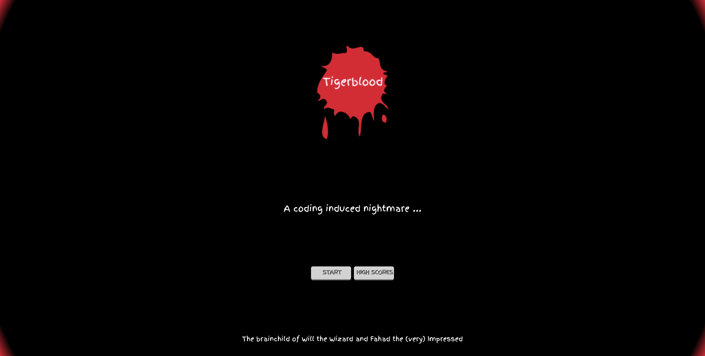

    <h3 align="center">Tigerblood</h3>
     
    

    A coding induced nightmare
     
     
    <a href="www.tigerbloodthegame.com" target="_blank">View Demo</a>
    

    
Table of Contents

    <ol>
        <li><a href="#about-the-project">Description</a></li>
        <li><a href="#built-with">Built With</a></li></li>
        <li><a href="#future-development">Future Development</a></li></li>
        <li><a href="#installation">Installation</a></li>
        <li><a href="#usage">Usage</a></li>
        <li><a href="#creators">Creators</a></li>
        <li><a href="#license">License</a></li>
        <li><a href="#summary">Summary</a></li>
    </ol>

### Description

This is a short browser based roguelike game, designed as an ode to our fellow bootcamp cohort members.

### Built With

Following languages, frameworks and libraries were used in the development of this project:

- HTML5, CSS3, JavaScript ES6
- Bootstrap4, NodeJS, Express, REACT, MongoDB/ Mongoose
- Rot.js, CodeMirror, Mocha, Chai.

### Future Development

While we couldn't include all of the features we wanted to during our short development time, we would love to eventually enable the following features in the future:

- Sound Effects and a soundtrack,
- Different difficulty levels,
- More stages and characters,
- More intricate doorlocks and functions,
- Mobile version or compatibility,
- Checkpoints.

### Installation

The deployed version requires no installation. For development purposes, you may fork and use 'npm install' to install the dependencies.

### Usage

Visit the deployed link on your computer\* and play. Don't forget to record your score!

\*(Game is not mobile or touch responsive and will crash due to Codemirror limitations.)

### Creators

1. William Utterback - Primary back-end development - Visit my GitHub profile at <a href="https://github.com/wjutterback">wjutterback</a> or my <a href="https://wjutterback.github.io/homepage/portfolio.html">Portfolio</a>.
2. Fahad Hai - Primary front-end development - Visit my GitHub profile at <a href="https://github.com/wdfhai">wdfhai</a> or my <a href="https://www.fhai.dev/">Portfolio</a>.

### License

This project is using the following license: MIT .

### Summary

We would like to thank all of our cohort students for an amazing time spent learning with all of you. You have left us with unforgettable memories and inside jokes (some of which we have included in the ganme). A very special thanks to our masterful instructor who was there for us every step of the way, whether to answer all of our stupid question ( Michael!) or to 'console our (javascript) bugs'. One day we hope to have enough time and money to make our dream projects happen and we'll be sure to invite you to take a look :D .
